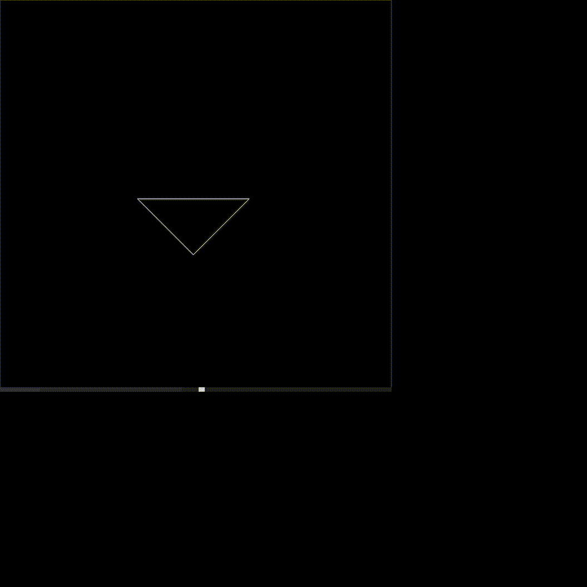
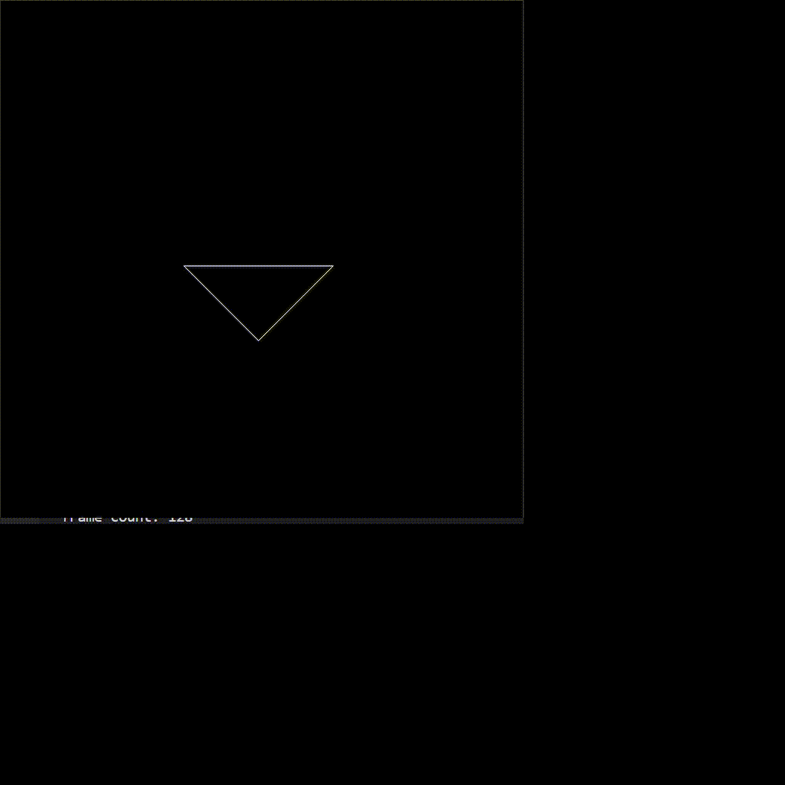

# GAMES101

<ul>
    <a name="catalogue">目录:</a> 
	<a href="#HW1">homework1</a> 
	<a href="#HW2">homework2</a>
</ul>

## <a name="HW1">homework1</a>

因为老师在视频里说了不让放源码，所以只在这里放结果。

这个是围绕z轴旋转的结果。

这个是围绕任意轴旋转的结果，这里设定的轴是（1，1，1）。

<a href="#catalogue"><-back</a>

## <a name="HW2">homework2</a>

1.粘贴HW1的投影函数时忘记把投影矩阵的初始化粘过去了，导致一直没有图形出现。

2.图形出现之后，结果上下颠倒且左右颠倒，按照搜索到的结果添加了z轴的翻转。

正确的结果出现啦~

提高篇：

<a href="#catalogue"><-back</a>
